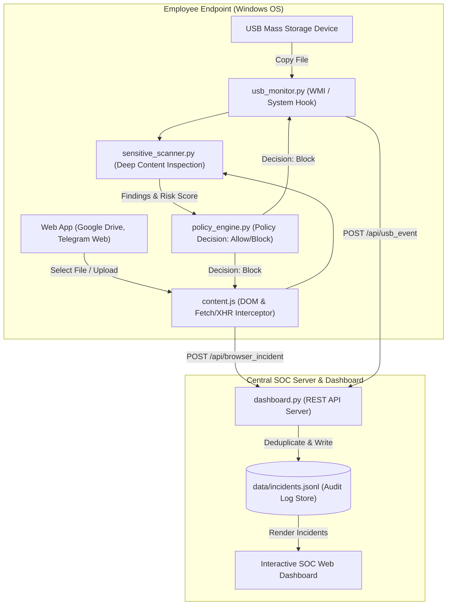

# Enterprise Data Loss Prevention (DLP) & Endpoint Security Suite
## Project Workflow, Architecture, Functions & Technology Stack

---

## 1. Project Overview & Executive Summary

This project is a comprehensive **Enterprise Data Loss Prevention (DLP) & Endpoint Security Suite** designed to prevent sensitive corporate data exfiltration across two critical attack vectors:
1. **Hardware / Physical Channel:** Unauthorized file transfers to USB removable storage devices.
2. **Network / Browser Channel:** Web application file uploads across major SaaS platforms (Google Drive, Telegram Web, Gmail, Dropbox, Microsoft OneDrive, WhatsApp Web, Slack, etc.).

When an employee attempts to copy or upload a file, the system performs **Real-Time Deep Content Inspection (DCI)**. If sensitive information—such as payroll tables, financial records, API keys, passwords, or personal identifiable information (PII)—is detected, the transaction is **blocked immediately**, and a high-priority incident is transmitted to a central **Security Operations Center (SOC) Dashboard** for security analyst review.

---

## 2. End-to-End Workflow & Architecture

### Workflow Steps:
1. **Interception (Physical & Network):**
   - **USB Channel:** The Windows WMI service detects USB drive insertions and intercepts filesystem file-copy events.
   - **Browser Channel:** The Chrome/Edge extension hooks into HTML `<input type="file">` pickers, Form submits, and JavaScript networking APIs (`window.fetch` and `XMLHttpRequest.prototype.send`) across all websites.
2. **Deep Content Inspection (DCI):**
   - The contents of the file are scanned in memory using regex tokenizers and Shannon entropy algorithms to detect confidential keywords, financial data, salary/payroll sheets, credentials, and PII.
3. **Automated Policy Enforcement:**
   - If policy rules are violated, the upload or copy is blocked instantly:
     - In **Google Drive/Telegram Web**, the file selection is canceled synchronously (`e.stopImmediatePropagation()`), input values are cleared, and resumable HTTP chunk uploads are aborted (`ERR_BLOCKED_BY_ENTERPRISE_DLP`).
     - An enterprise warning dialog is shown to the employee.
4. **Centralized SOC Reporting:**
   - The incident is reported to the backend REST API (`/api/browser_incident` or `/api/usb_event`).
   - The backend detects the web application name (e.g., `Google Drive`, `Telegram Web`, `Gmail`), applies **5-second server-side deduplication**, and logs the structured JSONL audit record.

---

## 3. Technology Stack & Rationale

| Layer / Module | Technologies Used | Why It Was Chosen |
| :--- | :--- | :--- |
| **Core Programming Language** | **Python 3.10+** | Provides rapid development, cross-platform system API bindings, robust regular expression engines, and lightweight web serving capabilities. |
| **Windows Hardware & OS Integration** | **PyWin32, Windows WMI (Windows Management Instrumentation)** | Enables direct kernel/system-level monitoring of USB mass storage insertions, volume serial numbers, and drive access control. |
| **Endpoint Browser Security** | **Manifest V3 Extension, Vanilla JavaScript (ES6), HTML5/CSS3** | Manifest V3 is the modern, secure extension standard for Google Chrome and Microsoft Edge. Vanilla JS ensures zero-dependency, ultra-fast DOM interception without conflicting with web frameworks like React or Angular. |
| **Security & Detection Engine** | **Python `re` (Regex), Shannon Entropy scoring** | Efficiently identifies structured data patterns (bank accounts, phone numbers, API keys) and high-entropy strings (secret tokens/passwords). |
| **Backend REST API Server** | **Python `http.server` (Custom Multi-threaded HTTP Server)** | Lightweight backend server that exposes JSON REST endpoints (`/api/incidents`, `/api/browser_incident`) without heavyweight framework overhead. |
| **SOC Dashboard Frontend** | **Responsive HTML5, Vanilla JavaScript, Custom CSS Design System** | Provides a modern, dark/light theme SOC dashboard with interactive filtering, status management, export tools, and real-time activity metrics. |
| **Database / Audit Storage** | **JSONL (JSON Lines) Append-Only Storage (`data/incidents.jsonl`)** | Append-only JSONL format guarantees high-speed logging, tamper-resilient audit history, and easy parsing/exporting for compliance reporting. |

---

## 4. Key Project Modules & Core Functions

### A. Backend DLP Agent & Core Engines (`dlp_agent/`)

#### 1. `agent.py` — Application CLI & Daemon Controller
* **`main()` / `build_parser()`:** Parses command-line arguments to launch specific subsystem modes (`usb`, `browser`, or `dashboard`).
* **`serve_dashboard()`:** Spawns the SOC management server and binds the REST API endpoints.

#### 2. `usb_monitor.py` — Hardware USB & File System Watcher
* **`start_monitoring()`:** Initializes Windows WMI event listeners to monitor physical USB mass storage device insertions and removals.
* **`detect_usb_drives()` / `get_device_serial()`:** Enumerates mounted drives, extracts unique USB hardware serial numbers, and verifies whether the device is authorized.
* **`monitor_file_transfers()`:** Intercepts file write/copy operations targeting external volumes and passes data to the scanner before permitting disk write.

#### 3. `sensitive_scanner.py` — Deep Content Inspection (DCI) Engine
* **`SensitiveDataScanner.scan_text(text)`:** Main inspection method that runs multi-layered security checks against text snippets and file buffers.
* **`_check_keywords()`:** Detects corporate classification markers (`CONFIDENTIAL`, `RESTRICTED`, `INTERNAL ONLY`).
* **`_check_financial()` & `_check_payroll()`:** Identifies bank account numbers, credit card sequences, and payroll/salary terminology.
* **`_check_credentials()`:** Evaluates regex and Shannon entropy to catch passwords, AWS tokens, API keys, and environment secrets.
* **`calculate_risk_score(findings)`:** Computes an automated risk severity score (from 0 to 100) and assigns a Criticality rating (`Critical`, `High`, `Medium`, `Low`).

#### 4. `policy_engine.py` — Enterprise Policy Decision Engine
* **`evaluate_policy(event_context)`:** Matches incoming operations against enterprise security policies (e.g., `EXT-HTTPS-001`).
* **`get_action_decision()`:** Returns the definitive policy enforcement decision (`Block`, `Alert`, or `Allow`) and policy violation rationale.

#### 5. `dashboard.py` — SOC Web Dashboard & REST API Server
* **`DashboardHandler.do_GET()`:** Serves the interactive HTML/CSS dashboard and returns filtered incident queries via `/api/incidents`.
* **`DashboardHandler.do_POST()`:** Handles incident ingestion from browser and USB endpoints (`/api/browser_incident`, `/api/usb_event`).
* **`_handle_browser_incident()`:** 
  * Parses blocked browser upload data.
  * **Dynamic App Detection:** Identifies the web application (`Google Drive`, `Telegram Web`, `Gmail`, `Dropbox`, `Microsoft OneDrive`, `Slack`, `WhatsApp Web`) from the target URL.
  * **Server-Side Deduplication:** Checks `DashboardHandler._recent_browser_incidents` to reject duplicate POST events occurring within 5 seconds.
  * Records the structured incident to the database.
* **`IncidentStore`:** Encapsulates JSONL database read/write operations, analyst assignment updates, status transitions (`Open`, `Investigating`, `Resolved`), and JSON/CSV exporting.

---

### B. Enterprise Browser Extension (`dlp_agent/browser_extension/`)

#### 1. `content.js` — Web Application Interception Hook
* **DOM File Input Hook (`addEventListener("change", ...)` & `"submit"`):**
  * Monitors `<input type="file">` elements across all web applications.
  * When a sensitive file is selected, it synchronously calls `e.stopImmediatePropagation()`, `e.preventDefault()`, and clears `e.target.value = ""`.
  * Prevents web applications (like Google Drive) from opening "Upload options / Replace existing file" modals.
* **Network Interception Hooks (`window.fetch` & `XMLHttpRequest.prototype.send`):**
  * Overrides HTTP networking APIs to inspect `FormData` file uploads.
  * Implements a **15-second resumable upload lock (`window.lastBlockedFile`)** that instantly aborts chunked API uploads (`/upload/drive/v3/files`) if an employee attempts to bypass the UI.
* **`reportToDashboard(url, fileName, sampleText)`:** Formats and transmits blocked incident data to the SOC server with **client-side 3-second deduplication**.
* **`blockAndAlert(url, fileName)`:** Triggers enterprise policy blocking and shows an immediate alert modal to the user.

#### 2. `bridge.js` & `background.js` — Cross-Boundary Messaging
* Relays custom events across nested web app iframes and shadow DOM boundaries so alerts reliably reach the background service worker and backend server.

---

## 5. Summary of Highlights for Teacher / Faculty Presentation

1. **Dual-Channel Defense:** Demonstrates protection against both physical hardware exfiltration (USB) and web-based cloud exfiltration (Google Drive / SaaS).
2. **Real-Time Deep Inspection:** Unlike basic file-extension blockers, this project inspects the **actual content** of files in memory before transmission.
3. **Advanced Web Interception:** Uses low-level DOM event bubbling cancellation (`stopImmediatePropagation`) and JavaScript API hooking (`fetch`/`XHR`) to block modern resumable web app upload APIs.
4. **Full Auditing & SOC Dashboard:** Provides a fully functional, enterprise-grade Security Operations Center (SOC) management interface with real-time risk scoring, dynamic application detection, and deduplication.
